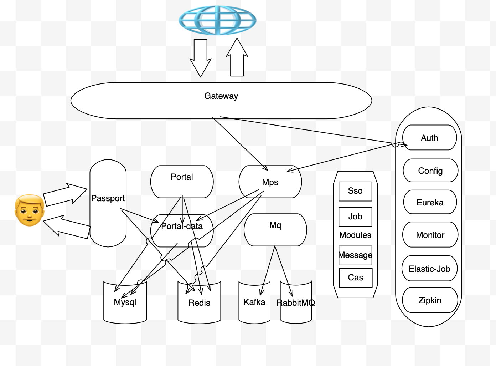

</img>

Vole
-------
Vole 是一个基于最新的SpringCloud2.0的商业开发脚手架,支持公司全方位应用架构搭建

## Features
* 基于Eureka的服务管理
* 基于Spring-Cloud-Config的配置管理
* 基于Spring-Oauth2的jwt鉴权服务
* 基于Zuul的网关服务
* 基于Elastic-Job的分布式job
* 基于ShardingSphere的分库分表
* 基于SpringAdmin的监控服务
* 基于Zipkin的链路监控服务
* 基于SpringCloudStream的消息驱动
* 基于SpringSecurity的cookie的sso统一登陆服务
* 支持分布式后台portal统一服务
* 支持网关的动态配置和流量控制
* 支持SpringSession的session管理
* 支持Redis的数据服务缓存
* 支持Hystrix的服务熔断管理
* 支持swagger2的api管理
* 支持Kafka,RabbitMQ,Rocketmq的消息接入
* 支持Spring-Oauth2的sso
* 支持Spring-Security的cas客户端
* 支持Spring-Security的cas客户端
* 支持FastDfs的客户端

## Docker
使用 docker-compose 部署Docker镜像

## 架构

## 组件
vole由`eureka`, `auth`,`config`,`gateway`,`mps`,`passport`,`portal`,`modules`组成

### Eureka
Eureka服务发现管理,支持高可用配置[更多](./docs/eureka.md)。

### Auth
Spring Oauth2鉴权管理支持jwt鉴权[更多](./docs/auth.md)。

### Config
Spring config的配置服务管理[更多](./docs/config.md)。

### Gateway
Zuul的网关服务，支持动态配置网关[更多](./docs/gateway.md)。

### Mps
会员管理中心[更多](./docs/mps.md)。

### Passport
后台统一登陆管理[更多](./docs/passport.md)。

### Portal
后台管理中心[更多](./docs/portal.md)。

### Modules
相关任务，消息，监控等组件[更多](./docs/modules.md)。

# 交流方式-微信

